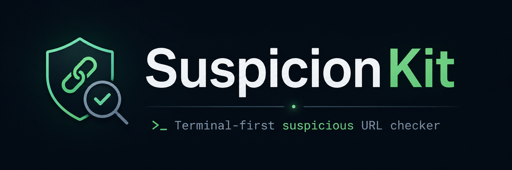
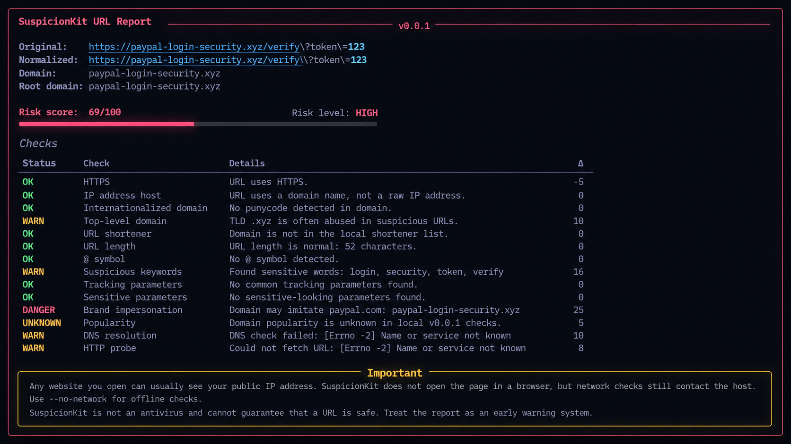

<p align="center">
  
</p>

<p align="center">
  
  
  
  
</p>

---

## ✨ What is SuspicionKit?

**SuspicionKit** is a small security-focused CLI tool that checks URLs for suspicious patterns and returns a clear risk report from **0 to 100**.

It is not an antivirus and it does not promise perfect detection. Instead, it helps you quickly understand whether a URL looks normal, suspicious, or risky before you open it in a browser.

---

## ⚡ Features in v0.0.1

- 🔗 URL normalization
- 🔒 HTTPS check
- 🌐 DNS availability check
- 🧭 Redirect detection
- 🕵️ URL shortener detection
- 🧬 Punycode / IDN warning
- 🚩 suspicious TLD detection
- 🧾 sensitive query parameter detection
- 📊 local popularity estimation
- 🎯 risk score from **0 to 100**
- 🎨 beautiful terminal report powered by **Rich**
- 📦 installable with **pipx**

---

## 🖼️ Preview



```bash
suspicionkit url "https://example.com"
```

Example output:

```text
SuspicionKit URL Report

Original:   https://example.com
Normalized: https://example.com/
Domain:     example.com
Root domain: example.com

Risk score: 5/100
Risk level: LOW
```

---

## 📦 Installation

### Recommended: pipx

```bash
python -m pip install --user pipx
python -m pipx ensurepath
pipx install git+https://github.com/notimechoki/suspicionkit.git
```

After installation:

```bash
suspicionkit --version
```

You can also use the short command:

```bash
skit --version
```

---

## 🧪 Local development installation

Clone the repository:

```bash
git clone https://github.com/notimechoki/suspicionkit.git
cd suspicionkit
```

Create a virtual environment:

```bash
python -m venv .venv
source .venv/bin/activate
```

Install in editable mode:

```bash
pip install -e ".[dev]"
```

Run the CLI:

```bash
suspicionkit url "https://github.com"
```

Run tests:

```bash
pytest -q
```

---

## 🚀 Usage

Check a URL with network checks:

```bash
suspicionkit url "https://github.com"
```

Check a suspicious-looking URL:

```bash
suspicionkit url "http://paypal-login-security.xyz/verify?token=123"
```

Run offline checks only:

```bash
suspicionkit url "https://example.com" --no-network
```

`--no-network` disables DNS and HTTP requests. This is useful when you want to inspect the URL without contacting the host.

---

## 🧠 How scoring works

SuspicionKit starts with a score of `0` and adds or subtracts points based on checks.

Examples:

- HTTPS lowers risk slightly
- HTTP increases risk
- suspicious keywords increase risk
- URL shorteners increase risk
- punycode increases risk
- sensitive query parameters increase risk
- known popular domains lower risk slightly

Final score:

| Score | Level |
|---:|---|
| 0–25 | Low |
| 26–55 | Medium |
| 56–80 | High |
| 81–100 | Critical |

---

## 🧰 Tech stack

- **Python 3.10+**
- **Typer** — CLI commands
- **Rich** — beautiful terminal output
- **HTTPX** — HTTP probing
- **tldextract** — domain parsing
- **dnspython** — DNS checks
- **pytest** — tests
- **ruff** — linting

---

## ⚠️ Important disclaimer

SuspicionKit is an early-warning tool. It cannot guarantee that a URL is safe or dangerous.

Any website you open can usually see your public IP address. SuspicionKit does not open the page in a browser, but network checks still contact the host. Use `--no-network` if you want local-only checks.

---

## 📄 License

MIT License.

